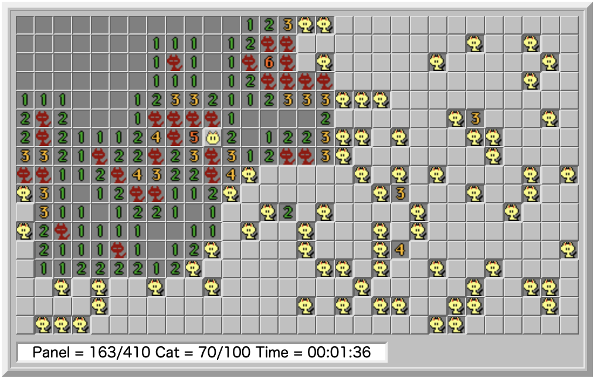

<h1> NyankoSweeper</h1>

Macintoshユーザには懐かしいNyankoSweeperをWeb上に再現

## デモ
https://kobalab.net/nyankosweeper/

## npm-scripts
| コマンド        | 説明
|:----------------|:-------------------------------------------
| ``release``     | リリース用にビルドする。
| ``build``       | デバッグ用にビルドする。
| ``build:js``    | JavaScriptのみデバッグ用にビルドする。
| ``build:css``   | CSSのみビルドする。
| ``build:html``  | HTMLのみビルドする。

## ライセンス
[MIT](https://github.com/kobalab/NyankoSweeper/blob/master/LICENSE)

## 作者
[Satoshi Kobayashi](https://github.com/kobalab)
